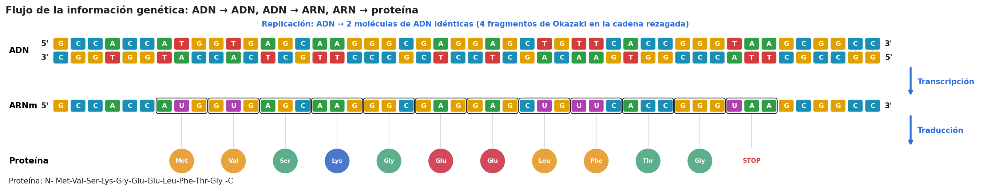
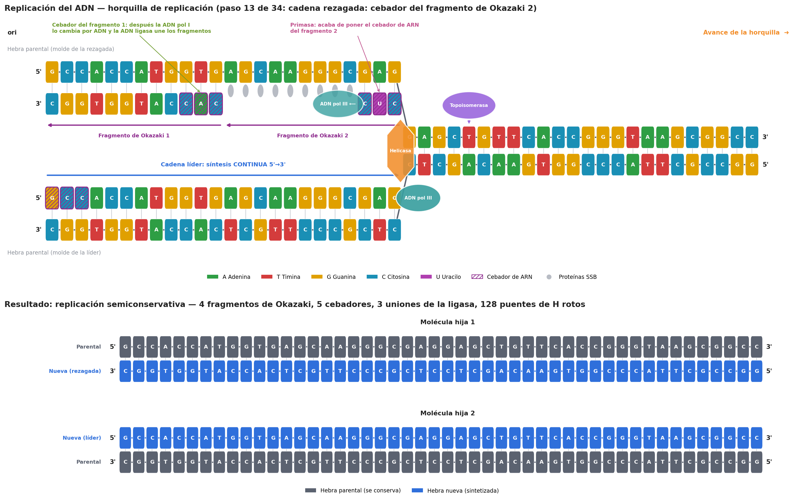
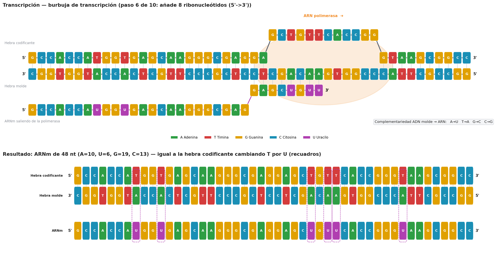
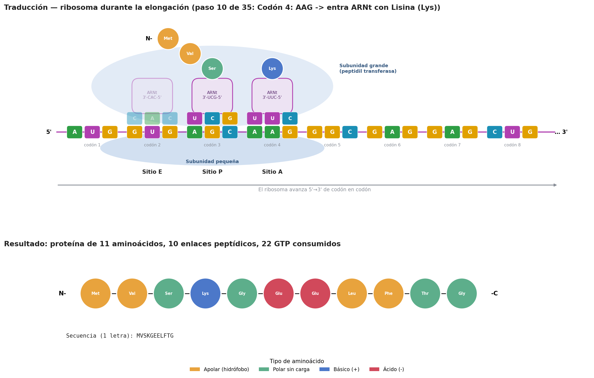

# Simulador del dogma central de la biología molecular

Programa en Python que simula, paso a paso y de forma integrada, el flujo de la
información genética:

```
          Replicación              Transcripción              Traducción
   ADN  ───────────────►  ADN  ───────────────►  ARNm  ───────────────►  Proteína
```

A partir de una secuencia de ADN, el simulador representa la **replicación**
(apertura de la doble hélice, cebadores, cadena líder, cadena rezagada y
fragmentos de Okazaki), la **transcripción** a ARN mensajero y la
**traducción** hasta obtener la secuencia de aminoácidos. Cada etapa se muestra
**en texto** (consola con colores) y **en imagen** (figuras PNG).

> Práctica 1 · Bioinformática · Grado en Ciencia e Ingeniería de Datos · ULPGC



---

## Índice

1. [Instalación](#instalación)
2. [Uso](#uso)
3. [Qué simula cada etapa](#qué-simula-cada-etapa)
4. [Visualización](#visualización)
5. [Requisitos de la práctica y dónde se cumplen](#requisitos-de-la-práctica-y-dónde-se-cumplen)
6. [Estructura del proyecto](#estructura-del-proyecto)
7. [Convenciones y simplificaciones](#convenciones-y-simplificaciones)
8. [Autores](#autores)

---

## Instalación

Requisitos: **Python 3.8 o superior** y **matplotlib** (solo para las imágenes;
la simulación en consola funciona sin él). Con Anaconda ya viene todo instalado.

```bash
git clone https://github.com/bioinformatica-ulpgc/simulador-dogma-central.git
cd simulador-dogma-central
pip install -r requirements.txt
```

## Uso

### Menú interactivo

```bash
python main.py
```

```
   1. Introducir una secuencia de ADN
   2. Generar un gen aleatorio
   3. Usar la secuencia de ejemplo (inicio del gen EGFP)
   4. Cargar una secuencia desde un archivo (.txt / FASTA / GenBank)
   5. Ver las enzimas y moléculas que intervienen
   6. Ver el código genético
   0. Salir
```

Después de elegir la secuencia se elige el modo de visualización:

| Modo | Descripción |
|---|---|
| **Paso a paso** | Se muestra cada evento (enzima que actúa, qué hace y estado de las moléculas) y se espera a pulsar Enter. Escribiendo `c` se muestra el resto seguido. |
| **Continuo** | Todos los pasos seguidos, sin pausas. |
| **Resumen** | Solo el resultado de cada etapa y el flujo completo. |

Al terminar, el programa pregunta si se quieren generar las imágenes de cada etapa.

### Línea de comandos

```bash
python main.py --ejemplo                               # secuencia de ejemplo, paso a paso
python main.py --secuencia ATGGCTAGCAAATAA --modo continuo
python main.py --aleatoria 12 --semilla 7 --modo resumen
python main.py --archivo ejemplos/egfp.fasta
python main.py --archivo ejemplos/lacZ_Ecoli_NC_000913.3.gb --modo resumen
python main.py --ejemplo --modo resumen --sin-imagenes
python main.py --help
```

| Opción | Descripción |
|---|---|
| `--secuencia SEQ` | Hebra codificante de ADN (5'→3'). Se ignoran espacios, números y minúsculas. |
| `--aleatoria N` | Genera un gen aleatorio con un AUG, `N` codones y un codón de parada. |
| `--semilla S` | Semilla para que el gen aleatorio sea reproducible. |
| `--ejemplo` | Inicio del gen **EGFP** (proteína verde fluorescente) con secuencia Kozak. |
| `--archivo RUTA` | Lee la secuencia de un archivo de texto, FASTA o GenBank (`.gb`, sección `ORIGIN`). |
| `--modo` | `paso` (por defecto), `continuo` o `resumen`. |
| `--sin-imagenes` | No genera las figuras PNG. |
| `--carpeta DIR` | Carpeta de salida de las imágenes (por defecto `resultados/`). |

La secuencia introducida se valida: si contiene un carácter que no es A, T, G o
C, el programa indica la posición exacta del error (por ejemplo, avisa si se
escribe `U`, que es una base del ARN).

---

## Qué simula cada etapa

### 1. Replicación del ADN (ADN → ADN)

Se simula una **horquilla de replicación** que parte del origen (extremo
izquierdo) y avanza por tramos. En cada tramo:

| Paso | Enzima / molécula | Qué hace |
|---|---|---|
| Iniciación | Proteínas iniciadoras (DnaA / ORC) | Reconocen el origen de replicación (*ori*). |
| Apertura | **Helicasa** (DnaB / MCM) | Rompe los puentes de hidrógeno (2 por A-T, 3 por G-C) y abre la doble hélice. |
| Tensión | **Topoisomerasa** (girasa) | Elimina el superenrollamiento por delante de la horquilla. |
| Estabilización | **Proteínas SSB** (RPA) | Mantienen separadas las hebras sencillas. |
| Cebado | **Primasa** (DnaG / pol α-primasa) | Sintetiza cebadores cortos de **ARN** con un 3'-OH libre. |
| Síntesis | **ADN polimerasa III** (pol ε / δ) + pinza deslizante (β / PCNA) | Añade dNTP en sentido **5'→3'** con complementariedad A-T, G-C. |
| Maduración | **ADN polimerasa I** (RNasa H + FEN1 + pol δ) | Sustituye los cebadores de ARN por ADN. |
| Unión | **ADN ligasa** | Sella las mellas entre fragmentos (enlace fosfodiéster). |

- **Cadena líder**: se sintetiza de forma **continua** con **un único cebador**,
  en el mismo sentido en que avanza la horquilla.
- **Cadena rezagada**: se sintetiza de forma **discontinua** en **fragmentos de
  Okazaki**, cada uno con su cebador, en sentido contrario al avance de la
  horquilla.
- El programa comprueba que se obtienen **dos moléculas idénticas a la
  original** (replicación **semiconservativa**) y explica el **problema de la
  replicación de los extremos** (telómeros y telomerasa).

Ejemplo de un paso en consola (los cebadores de ARN se ven en minúscula y, en la
terminal, con fondo magenta; `▲` es la helicasa y `═` la doble hélice sin abrir):

```
 [14/34] Elongación  │ ADN polimerasa III
   Cadena rezagada: sintetiza el fragmento de Okazaki 2
   Añade 9 dNTP en dirección 5'->3', es decir, ALEJÁNDOSE de la horquilla...

                                     10        20        30        40
   Hebra parental sup.    5' GCCACCATGGTGAGCAAGGGCGAGGAGCTGTTCACCGGGTAAGCGGCC 3'
   Nueva (rezagada)       3' CGGTGGTACcacTCGTTCCCGcuc························ 5'
     fragm. de Okazaki       111111111111222222222222
     horquilla                                       ▲═══════════════════════
   Nueva (líder)          5' gccACCATGGTGAGCAAGGGCGAG························ 3'
   Hebra parental inf.    3' CGGTGGTACCACTCGTTCCCGCTCCTCGACAAGTGGCCCATTCGCCGG 5'
```

### 2. Transcripción (ADN → ARNm)

| Fase | Qué se representa |
|---|---|
| Iniciación | El **factor σ** reconoce el promotor (cajas −35 y −10 / caja TATA) y la **ARN polimerasa** abre la burbuja de transcripción. No necesita cebador. |
| Elongación | La ARN polimerasa lee la **hebra molde 3'→5'** y sintetiza el ARNm **5'→3'** con las reglas **A→U, T→A, G→C, C→G**. La burbuja avanza y el ADN se vuelve a cerrar por detrás. |
| Terminación | Señal de terminación (horquilla GC + poli-U, factor Rho o señal poli-A) y liberación del ARNm. |

Se comprueba que el ARNm coincide con la **hebra codificante cambiando T por
U**, y se comenta el procesamiento del pre-ARNm en eucariotas (caperuza 5',
cola poli-A y *splicing*).

### 3. Traducción y síntesis de proteínas (ARNm → proteína)

| Fase | Qué se representa |
|---|---|
| Iniciación | La subunidad pequeña se une al ARNm (Shine-Dalgarno / caperuza 5') y localiza el primer **AUG**; el **ARNt iniciador** (Met / fMet) entra en el sitio **P** y se une la subunidad grande. |
| Elongación | Por cada codón: el aminoacil-ARNt con el **anticodón** complementario entra en el sitio **A** (EF-Tu), la **peptidil transferasa** forma el **enlace peptídico** y el ribosoma se **transloca** (EF-G); el ARNt vacío sale por el sitio **E**. |
| Terminación | Un **codón de parada** (UAA, UAG, UGA) entra en el sitio A, el **factor de liberación** libera la proteína y el ribosoma se disocia. |

Se usa el **código genético estándar completo (64 codones)**. El resultado
muestra la proteína en código de 1 y 3 letras, las regiones 5'-UTR y 3'-UTR, el
número de enlaces peptídicos y los GTP consumidos. Si no hay AUG o no hay codón
de parada, el programa lo explica.

```
   5'  AUG  GUG  AGC  AAG  GGC  GAG  GAG  CUG  UUC  ACC  GGG  UAA
       Met  Val  Ser  Lys  Gly  Glu  Glu  Leu  Phe  Thr  Gly  Stop
                  E    P    A
   Ribosoma:  E: AGC    P: AAG    A: GGC
   Cadena polipeptídica: N- Met-Val-Ser-Lys -C
```

---

## Visualización

Además de la salida por consola, se generan cuatro figuras en `resultados/`
(las de abajo corresponden a la secuencia de ejemplo):

**Replicación**: horquilla con todas las enzimas, cebadores de ARN (rayados),
cadena líder continua, fragmentos de Okazaki y las dos moléculas hijas.



**Transcripción**: burbuja de transcripción, híbrido ARN-ADN y ARNm resultante.



**Traducción**: ribosoma con los sitios E, P y A, ARNt con sus anticodones y
proteína final (aminoácidos coloreados por tipo de cadena lateral).



---

## Requisitos de la práctica y dónde se cumplen

| Requisito del enunciado | Cómo lo cumple el simulador |
|---|---|
| Apertura de la doble hélice | Helicasa (con recuento de puentes de H), topoisomerasa y SSB — `dogma/replicacion.py` |
| Participación de cebadores y enzimas | Primasa, cebadores de ARN, ADN pol III, pinza deslizante, ADN pol I y ligasa, con equivalentes eucariotas |
| Cadena líder | Síntesis continua desde un único cebador |
| Cadena rezagada y fragmentos de Okazaki | Síntesis discontinua, un cebador por fragmento, sustitución de cebadores y ligación |
| Transcripción con una hebra como molde | La ARN polimerasa lee la hebra molde 3'→5' — `dogma/transcripcion.py` |
| Complementariedad de bases | Reglas ADN-ADN, ADN-ARN y ARN-ARN (anticodones) — `dogma/secuencias.py` |
| Lectura en codones hasta la señal de terminación | Desde el primer AUG hasta UAA/UAG/UGA — `dogma/traduccion.py` |
| Visualización de cada etapa (texto o imagen) | Ambas: consola con colores (`dogma/consola.py`) y PNG (`dogma/visualizacion.py`) |
| Seguir el flujo ADN → ADN, ADN → ARN, ARN → proteína | Resumen final con ADN, ARNm y proteína alineados codón a codón (consola y `4_flujo_completo.png`) |
| Lenguaje e interacción libres | Python; menú interactivo y argumentos de línea de comandos |

---

## Estructura del proyecto

```
simulador-dogma-central/
├── main.py                 Punto de entrada: menú y línea de comandos
├── requirements.txt        Dependencias (matplotlib)
├── dogma/
│   ├── secuencias.py       Complementariedad, validación y generación de genes
│   ├── replicacion.py      ADN -> ADN (horquilla, líder, rezagada, Okazaki)
│   ├── transcripcion.py    ADN -> ARNm
│   ├── traduccion.py       ARNm -> proteína (código genético, ribosoma, ARNt)
│   ├── consola.py          Visualización en texto con colores
│   └── visualizacion.py    Figuras PNG con matplotlib
├── ejemplos/
│   ├── egfp.fasta          Secuencia de ejemplo en formato FASTA
│   ├── lacZ_Ecoli_NC_000913.3.fasta  Gen lacZ de E. coli (FASTA)
│   └── lacZ_Ecoli_NC_000913.3.gb     Gen lacZ de E. coli (GenBank)
├── docs/img/               Imágenes de ejemplo usadas en este README
└── resultados/             Imágenes generadas al ejecutar (no se suben al repositorio)
```

Cada módulo de simulación devuelve un objeto con el resultado y la **lista de
eventos** (fase, enzima, acción, explicación y estado de las moléculas en ese
momento). La consola y las imágenes solo leen esos eventos, de modo que la
lógica biológica está separada de la presentación. Cada módulo se puede
ejecutar por separado para una demostración rápida:

```bash
python -m dogma.replicacion
python -m dogma.transcripcion
python -m dogma.traduccion
```

---

## Convenciones y simplificaciones

- La secuencia introducida es la **hebra codificante (5'→3')**. Su complementaria
  (3'→5') es la **hebra molde** de la transcripción.
- La replicación usa **una sola horquilla** que parte del extremo izquierdo; en la
  célula la replicación es bidireccional desde cada origen.
- Los **fragmentos de Okazaki** (≈1000–2000 nt en procariotas, ≈100–200 nt en
  eucariotas) y los **cebadores** (≈10 nt) se reducen de tamaño para que se
  puedan ver en pantalla.
- Toda la secuencia se considera la unidad de transcripción (el promotor y el
  terminador se describen, pero no forman parte de la secuencia).
- Se trabaja con ARNm ya maduro: el *splicing* y el procesamiento eucariota se
  explican, pero no se simulan.
- La traducción empieza en el **primer AUG** y usa el **código genético
  estándar**.
- Comprobación con un gen real: con el gen **lacZ** de *E. coli*
  (`ejemplos/lacZ_Ecoli_NC_000913.3.gb`, 3075 pb) se obtiene la
  β-galactosidasa de 1024 aminoácidos, igual que la traducción oficial del
  registro GenBank (campo `/translation`).
- Los nombres de las enzimas son los de *E. coli*, con el equivalente eucariota
  entre paréntesis.

---

## Autores

- Aimar Daniel Alejandro Santana
- Daniel Perdomo Medina
